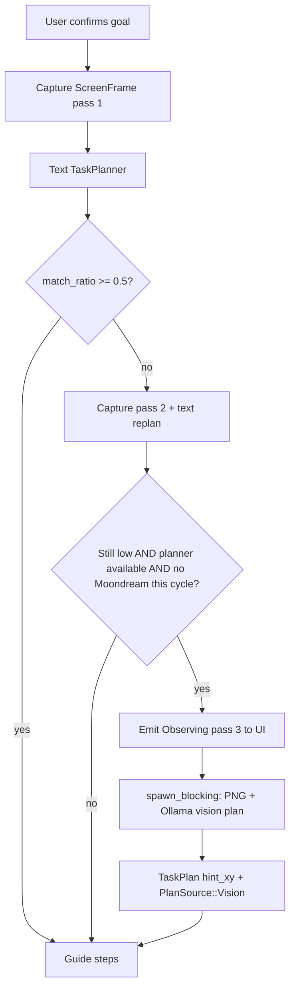

# Hybrid Vision Planner — Implementation Plan

> **For agentic workers:** REQUIRED SUB-SKILL: Use superpowers:subagent-driven-development (recommended) or superpowers:executing-plans to implement this plan task-by-task. Steps use checkbox (`- [ ]`) syntax for tracking.

**Goal:** Keep the fast UIA/OCR + text-LLM path as default, and add an **on-device screenshot → Ollama multimodal** planner fallback when text plans do not match the screen.

**Architecture:** Perception stays Option A (elements in `ScreenFrame`). Planning stays text-first via `TaskPlanner` + llama.cpp. When `PlanValidator` reports low `match_ratio` after the second capture, emit UI feedback **immediately**, then `VisionTaskPlanner` sends one downscaled PNG to Ollama. Coordinates flow **only** through `StepBlueprint.hint_xy` → `decision.rs` (no synthetic frame elements). Model availability is probed **once at startup**, not per plan cycle.

**Tech Stack:** Rust (Tauri 2), `perception/vision/capture.rs` (long-edge scale, aspect preserved), `OllamaClient::complete_vision_json_blocking`, llama.cpp text backend.

**Design spec:** [`docs/superpowers/specs/2026-05-18-hybrid-vision-planner-design.md`](../specs/2026-05-18-hybrid-vision-planner-design.md) (revision 2026-05-18c)

---

## Answer: can we use screenshots?

**Yes — already partially.** `capture_window_bitmap` + `complete_vision_json_blocking` exist; Moondream uses them for **element detection**, not planning. This plan wires the same capture path into **planning** as a fallback.

---

## Design decisions (locked — do not diverge)

| Topic | Decision |
|-------|----------|
| Anchor hints | **`StepBlueprint.hint_xy` only** — never inject synthetic `ScreenElement` |
| Model availability | **`bool` cached in `VisionTaskPlanner::new`** — no `/api/tags` in `observe_and_plan` |
| Screenshot resize | **Long edge → `MAX_EDGE`, uniform scale, no crop, no letterbox** (existing `capture_window_bitmap`) |
| Moondream dedupe | **Skip vision planner if perception already ran VLM** this cycle — no secondary `match_ratio` threshold |
| UX during wait | **`Observing { pass: 3 }` before `spawn_blocking`** — not after Ollama returns |

---

## File map

| Path | Responsibility |
|------|----------------|
| `src-tauri/src/settings.rs` | `vision_planner_*` settings + env parsing |
| `src-tauri/prompts/vision_task_planner.txt` | Multimodal plan prompt (post-scale `{width}×{height}`) |
| `src-tauri/src/prompts.rs` | `render_vision_task_planner` |
| `src-tauri/src/orchestration/vision_planner.rs` | **NEW** — capture, Ollama call, parse, `available` flag |
| `src-tauri/src/orchestration/plan.rs` | `PlanSource::Vision` |
| `src-tauri/src/orchestration/templates.rs` | `StepBlueprint.hint_xy` |
| `src-tauri/src/orchestration/planner.rs` | Preserve `x`/`y` → `hint_xy` in text JSON parse |
| `src-tauri/src/orchestration/decision.rs` | `hint_xy` when `find_best` misses |
| `src-tauri/src/orchestration/orchestrator.rs` | Gate fallback; emit pass 3 before blocking call |
| `src-tauri/src/lib.rs` or `main` setup | Log vision-planner availability at startup |
| `src-tauri/src/i18n.rs` | `guidance.observing_vision` |
| `README.md` | Env table + scale rule + `ollama pull` |

---

## Workflow change



---

## Phase 0 — Prerequisites (manual)

- [ ] **Ollama running** with a multimodal model:

```powershell
ollama pull qwen2.5vl:3b
ollama list
```

- [ ] **Text backend** still llama.cpp (`LLM_BACKEND=llamacpp`).

- [ ] **Baseline smoke:** simple Explorer task with `ROOTA_VISION_PLANNER=0`.

---

## Phase 1 — Settings

### Task 1: Perception settings for vision planner

**Files:**
- Modify: `src-tauri/src/settings.rs`

- [ ] **Step 1: Write the failing test**

```rust
#[test]
fn perception_defaults_vision_planner_off() {
    let s = PerceptionSettings::default();
    assert!(!s.vision_planner_enabled);
    assert_eq!(s.vision_planner_model, "qwen2.5vl:3b");
    assert!((s.vision_planner_timeout_secs - 90.0).abs() < f32::EPSILON);
    assert!((s.vision_planner_min_match - 0.5).abs() < f32::EPSILON);
    assert_eq!(s.vision_planner_max_edge, 768);
}
```

- [ ] **Step 2: Run test — expect FAIL**

`cd src-tauri && cargo test perception_defaults_vision_planner_off -- --nocapture`

- [ ] **Step 3: Add fields + env parsing** (see design spec table)

- [ ] **Step 4: Run test — expect PASS**

- [ ] **Step 5: Commit**

```bash
git add src-tauri/src/settings.rs
git commit -m "feat: add vision planner settings"
```

---

## Phase 2 — `hint_xy` only (no synthetic elements)

### Task 2: Carry planner coordinates into blueprints

**Files:**
- Modify: `src-tauri/src/orchestration/templates.rs`
- Modify: `src-tauri/src/orchestration/planner.rs`

- [ ] **Step 1: Failing test** — `parse_plan_json_preserves_hint_xy` (same as before)

- [ ] **Step 2: Run — FAIL**

- [ ] **Step 3: Add `hint_xy: Option<(i32, i32)>`** to `StepBlueprint`; wire `PlannedStepJson` `x`/`y`; default `None` everywhere else

- [ ] **Step 4: Run — PASS**

- [ ] **Step 5: Commit**

### Task 3: Decision engine uses hints only

**Files:**
- Modify: `src-tauri/src/orchestration/decision.rs`

- [ ] **Step 1: Failing test** — empty frame, `hint_xy: Some((200, 300))` → `anchor_xy == Some((200, 300))`

- [ ] **Step 2: Implement** — after `find_best_for_action` returns `None`, use `blueprint.hint_xy` for `anchor_xy`. **Do not** mutate `ScreenFrame.elements`.

- [ ] **Step 3: Run tests — PASS**

- [ ] **Step 4: Commit**

---

## Phase 3 — Vision planner module

### Task 4: Prompt + render

**Files:**
- Create: `src-tauri/prompts/vision_task_planner.txt`
- Modify: `src-tauri/src/prompts.rs`

Prompt must state image size is **after downscale** (`{width}x{height}` from `CapturedFrame`).

- [ ] **Commit** after prompt + render helper

### Task 5: `VisionTaskPlanner` + coord mapping

**Files:**
- Create: `src-tauri/src/orchestration/vision_planner.rs`
- Modify: `src-tauri/src/orchestration/mod.rs`

**Scaling (mandatory):** Use existing `CaptureOptions`:

```rust
let opts = CaptureOptions {
    max_edge: self.max_edge,
    scale: self.capture_scale,
    preprocess_ocr: false, // planner doesn't need OCR stretch
    ..Default::default()
};
// capture_window_bitmap: long edge ≤ max_edge, aspect preserved, no crop
```

**Availability (mandatory):**

```rust
pub struct VisionTaskPlanner {
    client: OllamaClient,
    available: bool,  // set in new(), never updated per plan
    // ...
}

impl VisionTaskPlanner {
    pub fn new(settings: &Settings) -> Self {
        let client = OllamaClient::for_vision_planner(settings);
        let available = client.vision_model_available(); // ONCE
        if available {
            tracing::info!(target = "roota.vision_planner", "vision planner model ready");
        } else {
            tracing::warn!(target = "roota.vision_planner", "vision planner model missing — fallback disabled");
        }
        Self { client, available, /* ... */ }
    }

    pub fn is_available(&self) -> bool {
        self.available
    }
}
```

- [ ] **Step 1: Failing test — aspect ratio**

```rust
#[test]
fn scale_1920x1080_to_max_edge_768() {
    // Given source 1920×1080, after capture options max_edge=768
    // Expected bitmap: 768×432 (long edge 768, aspect 16:9 preserved)
    let (w, h) = scaled_dimensions(1920, 1080, 768);
    assert_eq!((w, h), (768, 432));
}
```

Extract `scaled_dimensions` from the same math `capture_window_bitmap` uses, or test via a package-visible helper.

- [ ] **Step 2: Failing test — coord map**

Map model output `(400, 300)` on 768×432 bitmap with `source_rect` offset → screen `hint_xy` via `map_image_rect_to_screen`.

- [ ] **Step 3: Implement `plan_from_brief_blocking`** — parse JSON → `hint_xy` in **screen** space

- [ ] **Step 4: Run tests — PASS**

- [ ] **Step 5: Commit**

### Task 6: `PlanSource::Vision`

- [ ] Add variant to `plan.rs` + commit

---

## Phase 4 — Orchestrator integration

### Task 7: Gate + UX event timing

**Files:**
- Modify: `src-tauri/src/orchestration/orchestrator.rs`
- Modify: `src-tauri/src/i18n.rs`
- Frontend handler for `Observing { pass: 3 }` (if UI shows status strings)

**Gate function (pure, testable):**

```rust
fn should_run_vision_planner(
    enabled: bool,
    available: bool,           // cached bool — NOT a network call
    match_ratio: f32,
    min_match: f32,
    already_tried: bool,
    perception_used_vlm: bool, // frame.quality == VisionAssisted OR vision elements contributed
) -> bool {
    enabled
        && available
        && !already_tried
        && match_ratio < min_match
        && !perception_used_vlm
}
```

Tests:

| enabled | available | ratio | min | tried | vlm_ran | → |
|---------|-----------|-------|-----|-------|---------|---|
| true | true | 0.3 | 0.5 | false | false | **true** |
| true | true | 0.3 | 0.5 | false | **true** | **false** (Moondream skip) |
| true | true | 0.8 | 0.5 | false | false | false |

**`observe_and_plan` ordering (mandatory):**

```rust
if should_run_vision_planner(
    self.settings.perception.vision_planner_enabled,
    self.vision_planner.is_available(), // reads cached bool only
    report.match_ratio,
    self.settings.perception.vision_planner_min_match,
    vision_attempted,
    frame.perception_used_vlm(), // add helper on ScreenFrame
) {
    vision_attempted = true;

    // 1. UI feedback FIRST (60–90s wait starts here)
    sink.send(OrchestratorEvent::Observing { pass: 3 }).await;

    // 2. THEN blocking Ollama work
    let rect = frame.primary_capture_rect();
    let plan_result = tokio::task::spawn_blocking({
        let vp = self.vision_planner.clone();
        let brief = brief.clone();
        move || vp.plan_from_brief_blocking(&brief, rect, /* lang */)
    })
    .await;

    if let Ok(Ok(vision_plan)) = plan_result {
        plan = vision_plan;
        partial = PlanValidator::new().validate(&plan, &frame).needs_reobserve;
    }
}
```

Add `ScreenFrame::perception_used_vlm()`:

```rust
pub fn perception_used_vlm(&self) -> bool {
    self.quality == PerceptionQuality::VisionAssisted
        || self.elements.iter().any(|e| e.source == ElementSource::Vlm)
}
```

(Use actual `ElementSource` variant name from codebase — may be `Ocr` with VLM path; align with how Moondream tags elements.)

**i18n:** Add `guidance.observing_vision` ES/EN. Frontend: when `Observing.pass === 3`, show that string (not generic “observing”).

- [ ] Tests for `should_run_vision_planner` — PASS

- [ ] `cargo build` — PASS

- [ ] Commit

### Task 7b: Startup log (no per-cycle probe)

**Files:**
- Modify: `src-tauri/src/lib.rs` (or wherever `Orchestrator` is built)

- [ ] Construct `VisionTaskPlanner::new(&settings)` once; log `available` at info/warn level

- [ ] Verify logs show **one** availability line per app launch, not per failed plan

---

## Phase 5 — Ollama client helper

### Task 8: `for_vision_planner`

**Files:**
- Modify: `src-tauri/src/llm/ollama.rs`

- [ ] `OllamaClient::for_vision_planner(settings)` — uses `vision_planner_model`, `vision_planner_timeout_secs`

- [ ] `vision_model_available()` called only from `VisionTaskPlanner::new`

- [ ] Commit

---

## Phase 6 — Docs and manual verification

### Task 9: README

- [ ] Document env vars, startup probe, long-edge scale example (1920×1080 → 768×432)
- [ ] Note pass 3 UX event timing

### Task 10: Manual checklist

- [ ] `ROOTA_VISION_PLANNER=0` — no vision planner logs
- [ ] `ROOTA_VISION_PLANNER=1`, model missing — one startup warn; no `/api/tags` spam on failed plans
- [ ] Fallback path — **“reading screen with vision” appears immediately**, before plan returns
- [ ] `ROOTA_VISION_VLM=1` + Moondream ran — vision **planner** does not fire (dedupe)
- [ ] Overlay anchor lands near intended control on weak-UIA scenario

---

## Self-review (2026-05-18c)

| Review item | Addressed in |
|-------------|----------------|
| #1 Availability cache | Task 5 `available` field; Task 7b startup; gate uses bool only |
| #2 hint_xy only | Design decisions table; Task 3; removed synthetic elements |
| #3 Aspect ratio | Design spec § Screenshot scaling; Task 5 test 768×432 |
| #4 Moondream skip | `perception_used_vlm` in gate; removed 0.35 threshold |
| #5 Event before wait | Task 7 ordering + i18n + frontend note |

---

## Execution handoff

Plan updated per review (**2026-05-18c**). No implementation in this pass.

**Two execution options:**

1. **Subagent-Driven (recommended)** — fresh subagent per task, review between tasks  
2. **Inline Execution** — tasks in this session with executing-plans checkpoints  

Which approach do you want?
