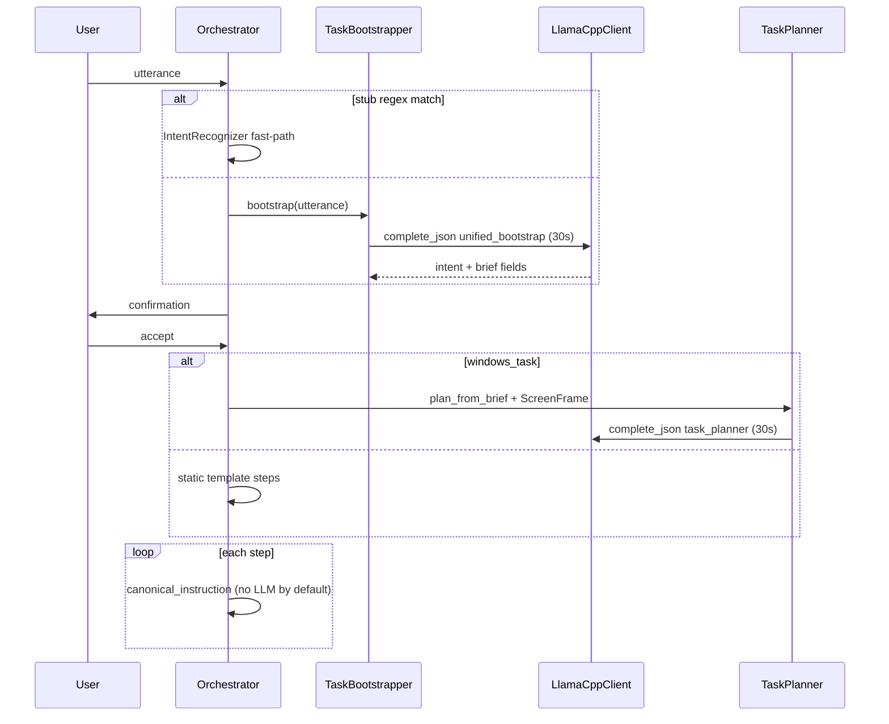

# Edge LLM CPU Performance — Design Spec

**Status:** Approved for implementation  
**Date:** 2026-05-17  
**Driver:** Hackathon Edge AI constraints — 4 sequential Ollama calls on CPU routinely exceed 10s each and fail; PRD §8 latency budgets cannot be met.

---

## Problem

Roota’s orchestration pipeline today makes **up to four text-LLM HTTP calls** per user goal on the slow path:

| # | Phase | Module | Timeout | Needs screen? |
|---|--------|--------|---------|----------------|
| 1 | Intent | `IntentRecognizer` | 10s (`LLM_INTENT_TIMEOUT_SECONDS`) | No |
| 2 | Brief | `BriefExtractor` | 10s (hardcoded) | No |
| 3 | Plan | `TaskPlanner` | 28s | Yes (post-confirm) |
| 4 | Step copy | `Orchestrator::instruction_for_step` | 8s | Yes (per step) |

On a hackathon laptop running **Ollama + qwen3:1.7b**, calls 1–2 often time out before 3 runs. Total worst-case wait exceeds 56s before guidance starts.

Replan (`ReplanEngine`) can add **another** planner call.

---

## Decision record

| Option | Verdict | Rationale |
|--------|---------|-----------|
| **llama.cpp `llama-server` + Q4 GGUF** | **Primary (this spec)** | PRD lists llama.cpp; user recommendation; exposes `-t`, `--batch-size`, `-c`; 2–4× faster than Ollama on same CPU; OpenAI-compatible HTTP → minimal Rust change |
| ONNX Runtime + Phi-3-mini INT4 | **Deferred (Phase 2 appendix)** | Hackathon-approved Edge AI stack; best raw CPU NLP; requires new Rust binding (`ort` crate) + model download pipeline; higher integration cost before demo |
| Keep Ollama for text | **Rejected as default** | Extra process overhead; same model weights slower; keep **only** for optional Moondream VLM (`ROOTA_VISION_VLM=1`) |

**Concrete target:** `llama-server` + `qwen3-1.7b-q4_k_m.gguf` + **one bootstrap JSON call** (intent+brief) + **one screen-grounded plan call** (windows_task only) + deterministic step copy by default + **30s** global text timeout.

**Blocking before implementation:** server context **`-c 1024`** (see § Context budget). Bootstrap fits in 512; the planner prompt does not.

---

## Goals / non-goals

### Goals

1. Default text backend = **llama.cpp** (`LLM_BACKEND=llamacpp`).
2. Collapse pre-confirm **intent + brief** into **one** `complete_json` (30s).
3. Keep **one** screen-grounded planner call for `windows_task` (cannot merge with bootstrap — no frame yet).
4. Default step instructions to **deterministic** `canonical_instruction`; LLM phrasing opt-in via env.
5. Preserve `LlmClient` trait, stub fast-path, `ResilientLlmClient`, and Ollama for vision only.
6. Document one-command dev startup (`scripts/start-llama.ps1`).

### Non-goals

- Bundling GGUF inside the Tauri binary (download script only for hackathon).
- Replacing Moondream / Ollama vision path in this iteration.
- ONNX implementation (documented as follow-up task in plan appendix).
- Changing perception / UIA / overlay geometry.

---

## Unified JSON contracts

### Bootstrap (pre-confirmation) — single call

```json
{
  "intent": "windows_task",
  "target": "Chrome",
  "params": {},
  "goal_summary": "Abrir Google Chrome",
  "app_hints": ["chrome"],
  "object_hints": ["chrome"],
  "risk_flags": []
}
```

Maps to existing `Intent` + `TaskBrief`. Stub regex fast-path **unchanged** (skips LLM entirely).

### Screen plan (post-confirmation, `windows_task` only) — unchanged schema

Existing `task_planner.txt` output:

```json
{
  "goal_summary": "...",
  "expected_window": "Chrome",
  "steps": [{"action": "click", "target": "..."}]
}
```

### Step instruction

No schema change. **Default off** for CPU mode: `ROOTA_STEP_LLM=0` uses only `canonical_instruction` + `accept_llm_instruction` validation path removed when disabled.

---

## Architecture



---

## Configuration

| Variable | Default | Purpose |
|----------|---------|---------|
| `LLM_BACKEND` | `llamacpp` | `llamacpp` \| `ollama` |
| `LLAMA_HOST` | `http://127.0.0.1:8080` | `llama-server` base URL |
| `LLM_TIMEOUT_SECONDS` | `30` | Per **inference** request (bootstrap, planner, optional step LLM) |
| `LLM_HEALTH_TIMEOUT_SECONDS` | `2` | Per **health probe** HTTP call only — never inherits `LLM_TIMEOUT_SECONDS` |
| `ROOTA_PLANNER_PROMPT_ELEMENTS` | `28` | Cap ranked element lines in planner prompt (defense in depth) |
| `ROOTA_STEP_LLM` | `0` | Per-step `complete_text` |
| `OLLAMA_HOST` | unchanged | Vision / fallback text only |

**Removed:** `LLAMA_MODEL` — llama-server binds the GGUF via `-m` at startup; the OpenAI `model` field in `/v1/chat/completions` is ignored. Do not add a vestigial env var.

**Removed:** `LLAMA_THREADS` / `LLAMA_CTX` as app env vars — these are **server launch flags** only (`scripts/start-llama.ps1`). Document defaults there, not in Rust settings.

Ollama-specific `LLM_INTENT_TIMEOUT_SECONDS` **deprecated** — bootstrap uses `LLM_TIMEOUT_SECONDS` only.

---

## Health check (startup)

Health probes run in Tauri `.setup()` via `build_llm_sync` and must **never block startup** on a hung server.

| Rule | Value |
|------|--------|
| Per-request timeout | **2.0s** hard cap (`LLM_HEALTH_TIMEOUT_SECONDS`), independent of `LLM_TIMEOUT_SECONDS` |
| Probe order | 1. `GET {LLAMA_HOST}/health` → 2. only if (1) fails or times out: `GET {LLAMA_HOST}/v1/models` |
| Success | First probe returning HTTP 2xx |
| Failure | Both probes fail/timeout → log `llama-server unreachable; stub only`, boot with `StubLlmClient` |
| Worst-case wall time | ≤ **4s** (2s + 2s); typical **≤ 2s** when `/health` exists |

Ollama text backend uses the same **2s** cap on `GET {OLLAMA_HOST}/api/tags` (unchanged behavior, explicit constant).

---

## Context budget (blocking)

`llama-server` is started with **one** context size for all calls. Bootstrap (~200–400 tokens) is small; the **planner** is not.

| Component | Typical size |
|-----------|----------------|
| `system_prompt.txt` + `windows_desktop_guide.txt` | ~400–600 tokens |
| `task_planner.txt` + brief block | ~150–300 tokens |
| `ranked_visible_summary_for_target` @ 60 elements | **800–1500+ tokens** (observed 173+ raw elements in logs; even capped lines add up) |
| Output JSON | ~100–200 tokens |

**`-c 512` silently truncates** the planner prompt → broken or empty plans with no client-side error.

**Required:**

1. **`scripts/start-llama.ps1`:** `-c 1024` minimum (default **1024**; allow override `-Context 2048` for dev only).
2. **`TaskPlanner`:** enforce `ROOTA_PLANNER_PROMPT_ELEMENTS` (default **28**) when calling `ranked_visible_summary_for_target` — use existing one-line format (`text (role) [src] @x,y`), not full UIA trees. Reuse `window_list_for_prompt` cap (`prompt_max_windows`, default 3).

Bootstrap does not need a separate context; it benefits from the same server process.

---

## JSON / `response_format` fallback

1. **Try** `response_format: { "type": "json_object" }` on `POST /v1/chat/completions`.
2. If HTTP **4xx** mentions unknown field → **retry once** without `response_format` (log `warn`: `json_mode_unsupported`).
3. On response body: `serde_json::from_str` failure → `warn` with `reason=json_parse_failed`, **truncated** raw prefix (≤ 200 chars), **never** conflate with stub.
4. Stub / heuristic fallback only at **orchestration** layer (`TaskBootstrapper`, `TaskPlanner`) with explicit `reason=stub_fallback` and `cause=timeout|llm_error|json_parse_failed|health_unavailable`.

This preserves demo debuggability: grep `json_parse_failed` vs `stub_fallback` in logs.

---

## llama-server launch (developer / demo)

```powershell
# scripts/start-llama.ps1
$Threads = (Get-CimInstance Win32_Processor).NumberOfLogicalProcessors
if (-not $Threads -or $Threads -lt 1) { $Threads = 4 }
$Model = "$env:USERPROFILE\.roota\models\qwen3-1.7b-q4_k_m.gguf"
& "$PSScriptRoot\..\bin\llama-server.exe" `
  -m $Model -t $Threads --batch-size 512 -c 1024 `
  --host 127.0.0.1 --port 8080
```

Thread count is **auto-detected** (no hardcoded `10`). `-c 1024` is the production default for planner headroom.

Chat: `POST {LLAMA_HOST}/v1/chat/completions` — see § JSON / `response_format` fallback above.

---

## Success metrics

| Metric | Before | Target |
|--------|--------|--------|
| LLM calls before confirmation | 2 | 1 (or 0 stub) |
| LLM calls start → first overlay | up to 4+ | ≤ 2 |
| Bootstrap latency (p50 laptop) | often timeout @10s | completes @30s |
| Step instruction LLM | every anchored step | off by default |

---

## Risks

| Risk | Mitigation |
|------|------------|
| llama-server not running | 2s health probes → stub; UI string `llama.unavailable` |
| Health check hangs | **2s** cap per probe; ordered `/health` then `/v1/models` |
| JSON mode unsupported on old binary | Retry without `response_format`; log `json_mode_unsupported` |
| Malformed JSON body | Log `json_parse_failed` with raw snippet; orchestration logs `stub_fallback` + `cause` |
| Context truncation @ 512 | **Blocking:** `-c 1024` + planner element cap 28 |
| Plan still slow | Heuristic plan fallback; `PlanSource::Heuristic` in logs |
| Demo machine lacks llama binary | README: fall back `LLM_BACKEND=ollama` |

---

## Appendix: ONNX path (future)

- Crate: `ort` 2.x with `Phi-3-mini-4k-instruct-onnx` INT4 from Hugging Face.
- New `OnnxClient` implementing `LlmClient` via synchronous `spawn_blocking`.
- Same unified bootstrap prompt; no HTTP server.
- Evaluate after llama.cpp wins are merged — swap `LLM_BACKEND=onnx`.
